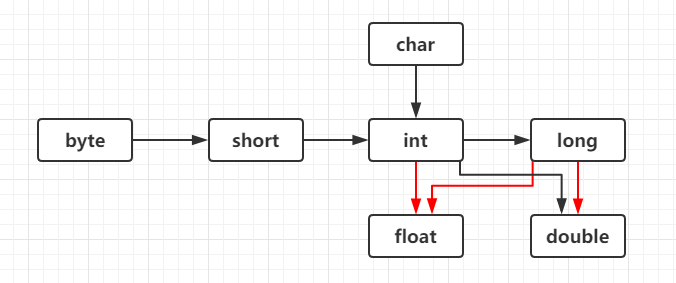

# Java基础

### 0x00关于Java

Java语言是美国SUN公司于1995年推出的计算机语言

Java之父：詹姆斯·高斯林

发展史：

2004年 Java5.0

2009年 Oracle甲骨文公司收购Sun公司

2014年 Java8.0

2018年9月 Java(11.0)


**跨平台：平台即操作系统，跨平台即在任意操作系统运行**

在需要运行Java运行程序的操作系统上，安装一个操作系统对应的Java虚拟（JVM）即可

**JRE：Java程序的运行时环境，包含JVM和运行时所需要的核心类库**

**JDK：Java程序开发的工具包，包含JRE和开发人员使用的工具**，开发工具包括：编译工具javac.exe和运行工具java.exe


### 0x01 IO流

Java通过引入Scanner类来获取用户的输入

```java
import java.util.Scanner;	
public class Main{
    public static void main(String[] args){
        Scanner input = new Scanner(System.in); //创建创建输入流对象 input
        String str = input.nextLine();			//nextLine方法会读取空格作为字符串内容，其他next方法啧不会
        System.out.println(str);
    }
}
```

由于没有nextChar()方法，在需要接收单个字符时，需要利用charAt()，通过接收字符串再取出其第一个字符 

```java
Scanner input = new Scanner(System.in);
char ch = input.next().charAt(0);    //取出字符串的第一个字符并接收
```

命令提示符窗口利用指令进行编译和执行

编译：javac 文件名.java

执行：java 类名

*Java严格区分大小写


### 0x02 注释

单行

```java
//注释信息
```

多行

```Java
/*
*注释信息
*注释信息
*/
```

文档注释	（自动由源文件生成一个HTML文档 ）

```java
/**注释信息*/
```


### 0x03 关键字和常量

**关键字：Java语言赋予特定含义的单词字母全部小写，在编译器中由特殊颜色标注**

**常量：在程序运行过程中，其值不可以改变的量**

```java
//字符串常量
System.out.println("Hello,world!");
//整数常量
System.out.println(114514);
//浮点常量
System.out.println(114.514);
//字符常量
System.out.println('壹');
//布尔常量
System.out.println(true);
//空常量null不可输出
```


### 0x04 数据类型


E+38表示是乘以10的38次方，同样，E-45表示乘以10的负45次方

```java
/*
*常数默认使用int类型,浮点数默认double类型
*定义float类型的数据时，为了防止类型不兼容,应添加后缀"f"或"F"
*定义long类型的数据时，为了防止整数类型过大,应添加后缀"l"或"L"
long a=1145141919L;
float b=114.514F;
```

**标识符：给变量、类、方法起名字的符号**

由数字、字母、下划线_和美元符$组成，不能以数字开头，不能是关键字，严格区分大小写

**小驼峰命名法：方法、变量**

- 约定1：标识符是一个单词的时候，首字母小写
- 范例1：name
- 约定2：标识符由多个单词组成时，第一个单词首字母小写，其他单词首字母大写
- 范例2：firstName

**大驼峰命名法：类**

- 约定1：标识符是一个单词的时候，首字母大写
- 范例1：Student
- 约定2：标识符由多个单词组成时，每个单词首字母大写
- 范例2：GoodStudent


### 0x05 类型转换



自动类型转换

```java
double a=10;	//a自动变为整型
short b=a;		//变为整形
```

强制类型转换

```java
int a=(int)88.88;	//a=88
```


### 0x06 算数运算符

利用"+"可以连接字符串，注意先后顺序

```java
System.out.println("114"+"514");
System.out.println(1+14+"514");	//输出：15514
System.out.println("114"+5+14);	//输出：114514

//算数运算中的隐式转换
short a=10;
a+=20;	//20的默认类型为int，此时a数据类型也被强制转换为int型
```

注意：利用"/"取结果的商时，若想得到的结果带小数，必须有浮点数参与运算

| 逻辑运算符     | 功能                                         |
| -------------- | -------------------------------------------- |
| &（逻辑与）    | 都true则true，所有的条件都判断               |
| \|（逻辑或）   | 都false则false，所有的条件都判断             |
| ！(非)         | 取反                                         |
| &&（短路与）   | 都true则true，有一个为false便不再继续判断了  |
| \|\|（短路或） | 都false则false，有一个为true便不再继续判断了 |
| ^（异或）      | 相同则为false，不相同则为true                |


### 0x07 循环结构

```java
//while循环
while( 布尔表达式 ) {
	//循环内容
}

//do...whille循环
do {
       //代码语句
}while(布尔表达式);

//for循环
for(初始化; 布尔表达式; 更新) {
    //代码语句
}

//增强for循环
for(声明语句 : 表达式)
{
   //代码句子
}
```

增强版for循环测试用例

```java
public class Test{
    public static void main(String args[]){
        int [] numbers = {10, 20, 30, 40, 50};
        for(int x : numbers ){
            System.out.print( x );
            System.out.print(",");
        }
        
        System.out.print("\n");
        
        String [] names ={"James", "Larry", "Tom", "Lacy"};
        for( String name : names ) {
            System.out.print( name );
            System.out.print(",");
        }
    }
}
```


### 0x08 分支结构

```java
//if语句
if(布尔表达式)
{
   //如果布尔表达式为true将执行的语句
}

//if...else 语句
if(布尔表达式){
   //如果布尔表达式的值为true
}else{
   //如果布尔表达式的值为false
}

//if...else if...else 语句
if(布尔表达式 1){
   //如果布尔表达式 1的值为true执行代码
}else if(布尔表达式 2){
   //如果布尔表达式 2的值为true执行代码
}else if(布尔表达式 3){
   //如果布尔表达式 3的值为true执行代码
}else {
   //如果以上布尔表达式都不为true执行代码
}

//嵌套的 if…else 语句
if(布尔表达式 1){
   ////如果布尔表达式 1的值为true执行代码
   if(布尔表达式 2){
      ////如果布尔表达式 2的值为true执行代码
   }
}

//switch 语句
switch(expression){
    case value :
       //语句
       break; //可选
    case value :
       //语句
       break; //可选
    //你可以有任意数量的case语句
    default : //可选
       //语句
}
```

注：switch 语句中的变量类型只能为 byte、short、int 或者 char。从 Java SE 7 开始，switch 支持字符串 String 类型了，同时 case 标签必须为字符串常量或字面量。

### 0x09 Randow产生随机数

1.利用Math.random()

```java
double random = Math.random();	//产生一个[0，1)之间的随机数
```

2.利用Random类

```java
import java.util.Random;		//引入Random类

Random num = new Random();		//程序取当前日期的毫秒数作为种子
int num = num.nextInt(seed);	//产生[0，seed)之间的随机数
//利用该方法还可产生Boolean、Double、Float、Long等类型的随机数
```


### 0x0A IDEA快捷键

单行注释：Ctrl+/

多行注释：Ctrl+Shift+/

以上两条代码，再次使用可取消

格式化：Ctrl+Alt+L

当前文档进行替换：Ctrl+R

删除光标所在行：Ctrl+Y

此外，在IDEA中可以通过输入快速生成语句

1.main方法

在类体中输入"psvm"，回车。生成如下代码

```java
public static void main(String[] args) {
 
}
```

2.打印输出

在类体中输入"sout"，回车生成如下代码

```java
System.out.println();
```


### 0x0B 数组

```java
//数组定义
int[] nums;
//定义动态大小数组
int[] nums = new int[length];	

//静态初始化
int[] nums = {1,2,3};
```

从数组了解Java内存分配：关于“堆内存”和“栈内存”

栈内存：存储数组类型，以及数组的内存地址

堆内存：用于存放数组实体

```java
int[] nums1 = new int[3];
int[] nums2 = nums1;
//此时栈内存中的nums1和nums2存储的内存地址相同
```

*数组操作时需注意的问题

1.数组越界：访问了数组中不存在的索引对应的元素，造成索引越界

2.空指针异常：访问的数组已经不再指向堆内存的数据，造成空指针异常

```java
int[] nums = {1,3,5,7,9}
//范围for语句实现遍历
for(int num:nums){
    System.out.println(num);
}
//通用格式
for(int i = 0; i < nums.length; i++){
    System.out.println(nums[i]);    
}
```


### 0x0C 方法

**方法**（method）

将具有独立功能的代码块组织成一个整体，使其具有特殊功能的代码集。

方法必须要先创建在使用，该过程成为方法定义

且创建后不是直接运行，需要手动执行后才执行，该过程称为方法调用

```java
public static 返回类型 方法名称(数据类型 参数1,数据类型 参数2, ......) {
	方法体代码;
	[return [返回值];]
}
```

方法定义中的参数分为**形参**和**实参**

形参：等同于变量定义格式，例如：int number

实参：等同于使用变量或常量，例如：10、number

```java
//方法间参数调用时，局部变量优先级更高
class Main {
    public static void main(String[] args) {
        int num = 100;
        System.out.println(num);	//运行结果为100
    }
    public static void method(int num) {
        num=200;
    }
}

//方法调用参数为数组时,默认为引用类型
class Main {
    public static void main(String[] args) {
        int[] arr = {10, 20, 30};
        System.out.println(arr[0]);
        change(arr);
        System.out.println(arr[0]);
    }

    public static void change(int[] arr) {
        arr[0] = 200;
    }
}
```

*方法定义中需要注意的问题

方法不能嵌套定义

```java
//如下的定义方式是错误的
public static void main(String[] args) {
	public static int method(int num) {
    }
}
```

使用无返回值类型（void）方法时，可以省略return，也可单独书写

```java
public static void method(int num) {
	//return;	可加可不加，return后不得跟随数据
}
```

当多个**同名**方法处于**一个类**中，但彼此**参数类型、数量不相同**时构成**”重载“**

原理：针对同名类中方法的名称和参数进行识别，**与返回值无关**


### 0x0D 封装

**封装、继承、多态**是”面向对象“的三大特征

封装是”面向对象“的编程语言对客观世界的模拟，客观世界里成员变量都是隐藏在对象内部的，外界是无法直接操作的

封装将某些类的信息隐藏在类的内部，不允许外部程序直接访问，而是通过提供getXxx()/setXxx()方法来实现对隐藏成员变量的访问和操作

利用方法控制成员变量，充分提高了代码的安全性。同时，封装代码提高了代码的复用性


### 0x0E 类和对象

类：由属性和行为组成，是对一组对象的属性和行为的抽象

​	通过成员变量体现属性

对象：真实存在的实体，具有独立的属性

​	通过成员方法体现行为

API（Application Programming Interface）,应用程序编程接口

Java API ：指的就是JDK中提供各种功能的Java类，这些类将底层的实现封装了起来

Java中引入**private**类型，防止类中的数据成员在类的定义之外被修改。即private类型的数据成员只能在定义的时候修改，其余任何地方都不可以，该类的对象也不可以

```java
public class Student {
    //成员变量
    private String name;
    private int age;
}
```


**this.变量名称**

指的是访问类中的成员变量，用来区分成员变量和局部变量（重名问题）

```java
public void setName(String name){
	this.name = name;
}
```

1.this修饰的变量用于指代成员变量

- 方法的形参如果与成员变量同名，不带this修饰的变量指的是形参，而不是成员变量
- 方法的形参没有与成员变量同名，不带this修饰的变量指的是成员变量

2.this变量用于解决局部变量与成员变量的冲突

3.this代表所在类的对象引用，方法被哪个对象调用，this就代表哪个对象


标准类：**成员变量+构造方法+成员方法**

**成员变量** 需使用private修饰

若构造函数无参，则创建对象后使用setXXX()赋值

使用带参构造方法直接创建带有属性值的对象

**构造方法** 提供一个无参构造和一个有参构造

```java
public 类名(){
    System.out.println("无参构造函数");
}
```

注意事项

1.构造方法的创建

在创造类时，如果没有定义构造方法，系统将给出一个默认的无参构造方法

如果自行定义，系统将不再给出默认的构造方法

2.构造方法的重载

如果自定义了带参数构造方法，还要使用无参构造方法，就必须再写一个无参构造方法

**成员方法**

根据成员变量提供对应的setXXX()/getXXX()，另需提供一个显示对象信息的show()

```java
//getXXX()/setXXX方法
public void setXXX(type name){
    this.name = name;
}
public String getXXX(type name){
    return name;
}
//show方法
public void show(){
    System.out.println(name);
}
```


### 0x0F String类

在Java中，字符串是一个**类**，所以我们见到的字符串都是**对象**

String构造方法

```java
//public String() 创建一个空白字符串对象，不含任何内容
String str1 = new String();
System.out.println("str1="+str1);

//public String() 根据字符数组内容创建字符串
char[] chs= {'a','b','c'};
String str2 = new String(chs);
System.out.println("str2="+str2);

//public String() 根据字节数组内容创建字符串
byte[] bys= {97,98,99};
String str3 = new String(chs);
System.out.println("str3="+str3);

//直接赋值创建字符串对象
String str4 = "abc";
System.out.println("str4="+str4);
```

Java对象特点

1.通过new创建的字符串对象，每一次new都会申请一个内存空间，虽然内容相同，但是地址值不同

2.以""方式给出的字符串，只要字符序列相同（顺序和大小写），无论在程序代码中出现几次，JVM都只会建立一个String对象，并在**字符串常量池**中进行维护

*通过+进行字符拼接时，会创建新的字符串对象

```java
//构造得到对象
char[] chs={'a','b','c'};   
String str1 = new String(chs);
String str2 = new String(chs);
System.out.println(str1==str2); //false

//赋值得到对象
String str3 = "abc";    
String str4 = "abc";
System.out.println(str3==str4); //true
```

使用==做比较

```java
//基本类型：比较数据值是否相同
System.out.println(1==2);
//引用类型：比较地址值是否相同
System.out.println(str1==str2);
//字符串是对象，比较其内容时，需要借助equal()方法
System.out.println(str1.equal(str2));
```

StringBuilder基本用法

```java
StringBuilder strbuilder = new StringBuilder();		//创建StringBuilder对象
strbuilder.append(String str);						//连接字符串、字符
strbuilder.insert(int offset, String str);			//在指定位置之前插入字符(串)
strbuilder.replace(int start,int end,String[] str) 	//将[start，end）的字符替换为str
strbuilder.delete(int start, int end)	//删除[start，end）的字符串，包含start，不包含end位置。
char ch = strbuilder.charAt(3);			//读取字符串索引为index的字符
String str = strbuilder.toString();		//转化为String类型传递
String str = strbuilder.reverse().toString();		//将StringBuilder对象翻转并输出
```

### 0x0G ArrayList类

```java
import java.util.ArrayList;		//导包
ArrayList<String> str = new ArrayList<String>();	//创建集合对象
str.add(index,String str);		//在索引处添加字符（串）
str.remove(String str);			//删除指定字符（串），返回true/false
str.remove(int index);			//删除指定字符（串），返回删除对象
str.set(int index,String str);	//修改索引位置内容，返回true/false
str.get(int index);				//返回索引位置内容
str.size();						//获得集合长度
```


